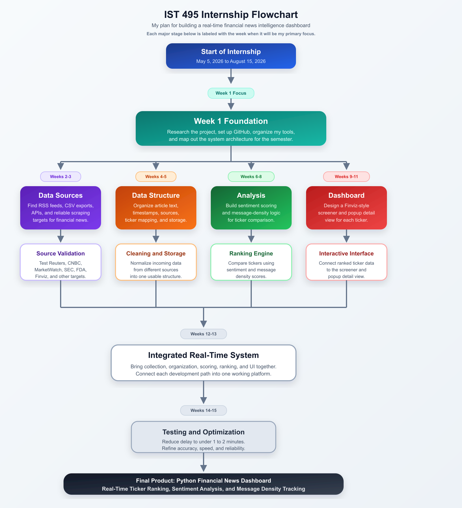

# Stock Price Prediction

Stock Price Prediction is a project focused on forecasting stock price movement by combining historical market data with financial news sentiment.

The application is designed to collect stock data, analyze related financial news, generate sentiment signals, and use those inputs to support predictive modeling in a dashboard environment.

## Goals

- collect historical stock price data
- analyze financial news related to selected stocks
- transform news coverage into sentiment-based features
- combine price and sentiment data in a prediction model
- present forecasts and supporting insights in a clear dashboard

## Workflow

1. Collect stock market data
2. Collect financial news data
3. Run sentiment analysis
4. Combine features
5. Train and evaluate a model
6. Present results in the dashboard

## Project Flowchart

